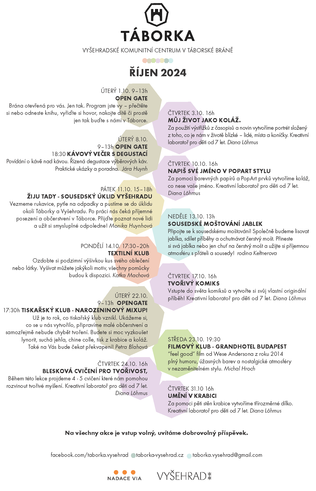
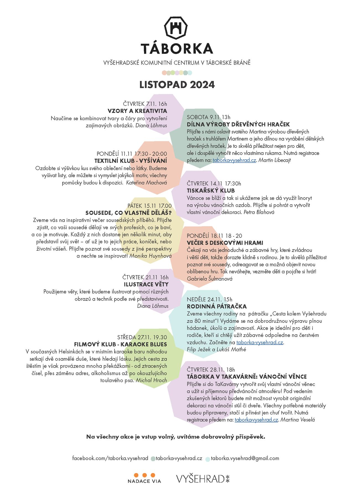

[Táborská brána na Vyšehradě](https://mapy.cz/s/kupodozeju) už není jen historickou památkou. Od jara 2023 je místem setkávání, kde mohou místní tvořit, relaxovat a vzdělávat se. Prostor, kde se potkávají sousedé, kteří by se jinak nepotkali a to hned ze 4 čtvrtí, které Vyšehrad obklopují. Překážkou jim není věk, hendikep či finanční možnosti. Podpořte mezigenerační křižovatku!

* [Odebírejte newsletter](https://dashboard.mailerlite.com/forms/349654/86367320907187267/share) a budete všechno vědět první
* [Podpořte Táborku](https://www.darujme.cz/taborka)
* [Táborka na fb](https://www.facebook.com/taborka.vysehrad)

## Aktuálně - registrace na listopadové akce
Na některé listopadové akce je potřeba se předem registrovat. Pomůže nám to hlavně připravit materiál a rozdělit kapacity. Díky!

* [**Sobota 9.11.** DÍLNA VÝROBY DŘEVĚNÝCH HRAČEK](https://forms.gle/1CntLRs3btNVm21a8)
  Přijďte s námi oslavit svatého Martina výrobou dřevěných hraček s Martinem! Truhlář Martin Libecajt opět zopakuje svou loňskou dílnu. Společně budeme vyrábět dřevěné hračky, což je skvělá příležitost nejen pro děti, ale i dospělé zapojit svou kreativitu a vytvořit něco vlastníma rukama. [Registrace]((https://forms.gle/1CntLRs3btNVm21a8))
* **Neděle 24.11.** Rodinná pátračka - zde najdete již brzy úvodní propozice.
* [**Čtvrtek 28.11.** TÁBORKA V TAKAVÁRNĚ: VÁNOČNÍ VĚNCE](https://forms.gle/Eiheknand4MTGcHRA)
  Přijďte si do TaKavárny vytvořit svůj vlastní vánoční věnec a užít si příjemnou předvánoční atmosféru! Pod vedením zkušených lektorů budete mít možnost zapojit svou kreativitu a vyrobit originální dekoraci na vánoční stůl či dveře. Všechny potřebné materiály budou připraveny, stačí si přinést jen chuť tvořit. A samozřejmě si můžete dát i něco dobrého z naší oblíbené kavárny. Těšíme se na vás! [Registrace](https://forms.gle/Eiheknand4MTGcHRA)

## Program říjen

## Program listopad

## Aktuální kalendář - co se děje
<iframe src="https://calendar.google.com/calendar/embed?height=600&wkst=2&ctz=Europe%2FPrague&bgcolor=%23ffffff&showCalendars=0&src=dGFib3JrYS52eXNlaHJhZEBnbWFpbC5jb20&color=%23F6BF26" style="border:solid 1px #777" width="800" height="600" frameborder="0" scrolling="no"></iframe>

## Programy minulé
* [Listopad](Programy/Taborka-2024-11.pdf)
* [Říjen](Programy/Taborka-2024-10rijen.pdf)
* [Září 2024](Programy/Taborka-2024-09.pdf), [Zažít město jinak 2024](Imgs/Plakat_ZMJ.png)
* [Červenec a srpen 2024](Programy/Taborka-2024-0708.jpg)
* [Červen 2024](Programy/Taborka-2024-06.pdf )
* [Květen 2024](Programy/Taborka-2024-05.pdf )
* [Duben 2024](Programy/Taborka-DUBEN-2024.pdf )
* [Březen 2024](Programy/Taborka-BŘEZEN-2024-v2d.pdf)
* [Leden-únor 2024](Programy/Taborka-A4-plakat-ledenunor.pdf)
* [Prosinec 2023](Programy/Taborka-2023-12.jpg)
* [Listopad 2023](Programy/Taborka-2023-11.jpg)
* [Říjen 2023](Programy/Taborka-2023-10rijen.pdf)
* [Září 2023](Programy/Taborka-2023-09zari.pdf)
* [Jaro 2023](Programy/Taborka-2023-05PrvniJaro.jpg)

## Děkujeme
*  [Nadace Via](https://www.nadacevia.cz/)
*  [Národní kulturní památka Vyšehrad](https://www.praha-vysehrad.cz/cs)

\
*Vaše*

Táborka z.s.\
IČO 19535970 \
Ve Svahu 1, Praha 4 \
(Ale najdete nás o kousek vedle, V pevnosti 35/11, Praha 2)\
\
[taborka.vysehrad@gmail.com](mailto:taborka.vysehrad@gmail.com)\
\
[Stanovy spolku](Imgs/Taborka-stanovy.pdf)\
[Výroční zpráva 2023](Imgs/Taborka-vyrocni zprava 2023.pdf)\
\
---
*[[Edit]](https://github.com/filip-jezek/taborka_cz)*
