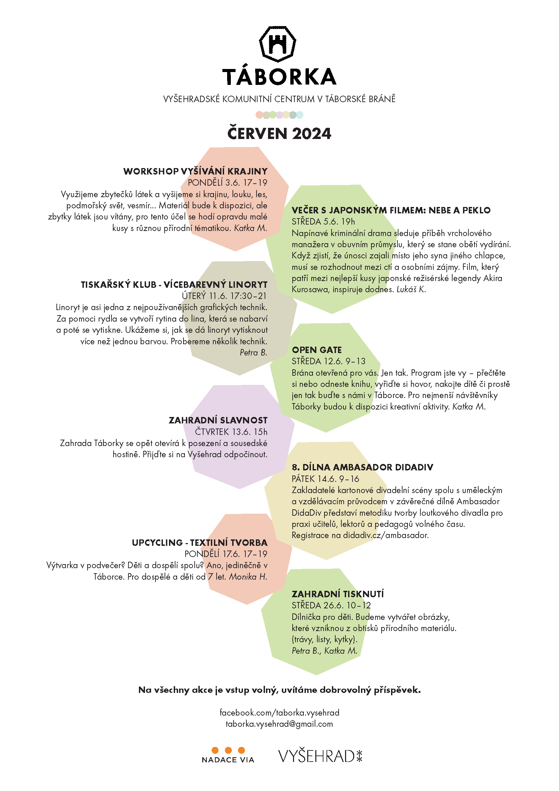

[Táborská brána na Vyšehradě](https://mapy.cz/s/kupodozeju) už není jen historickou památkou. Od jara 2023 je místem setkávání, kde mohou místní tvořit, relaxovat a vzdělávat se. Prostor, kde se potkávají sousedé, kteří by se jinak nepotkali a to hned ze 4 čtvrtí, které Vyšehrad obklopují. Překážkou jim není věk, hendikep či finanční možnosti. Podpořte mezigenerační křižovatku!

* [Odebírejte newsletter](https://dashboard.mailerlite.com/forms/349654/86367320907187267/share) a budete všechno vědět první
* [Podpořte Táborku](https://www.darujme.cz/taborka)
* [Táborka na fb](https://www.facebook.com/taborka.vysehrad)

## Aktuálně

### Zahradní slavnost ve čtvrtek 13. června
Jaro se přelamuje do léta, zahrada v plném květu, Táborka zve k posezení na zahradě! Kdo přinese nejlepší koláč?

Těšíme se na Vás!
Pozvěte své sousedy!

 
 
 

## Program červen

## Programy minulé
* [Červen 2024](Programy/Taborka-2024-06.pdf )
* [Květen 2024](Programy/Taborka-2024-05.pdf )
* [Duben 2024](Programy/Taborka-DUBEN-2024.pdf )
* [Březen 2024](Programy/Taborka-BŘEZEN-2024-v2d.pdf)
* [Leden-únor 2024](Programy/Taborka-A4-plakat-ledenunor.pdf)
* [Prosinec 2023](Programy/Taborka-2023-12.jpg)
* [Listopad 2023](Programy/Taborka-2023-11.jpg)
* [Říjen 2023](Programy/Taborka-2023-10rijen.pdf)
* [Září 2023](Programy/Taborka-2023-09zari.pdf)
* [Jaro 2023](Programy/Taborka-2023-05PrvniJaro.jpg)

## Aktuální kalendář - co se děje
<iframe src="https://calendar.google.com/calendar/embed?height=600&wkst=2&ctz=Europe%2FPrague&bgcolor=%23ffffff&showCalendars=0&src=dGFib3JrYS52eXNlaHJhZEBnbWFpbC5jb20&color=%23F6BF26" style="border:solid 1px #777" width="800" height="600" frameborder="0" scrolling="no"></iframe>

## Děkujeme
*  [Nadace Via](https://www.nadacevia.cz/)
*  [Národní kulturní památka Vyšehrad](https://www.praha-vysehrad.cz/cs)

\
*Vaše*

Táborka z.s., \
IČO 19535970\
[taborka.vysehrad@gmail.com](mailto:taborka.vysehrad@gmail.com)
