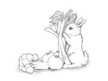
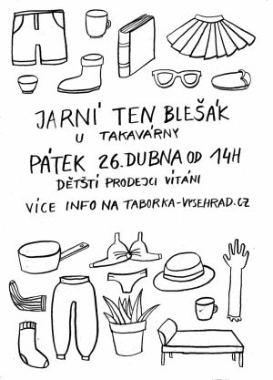
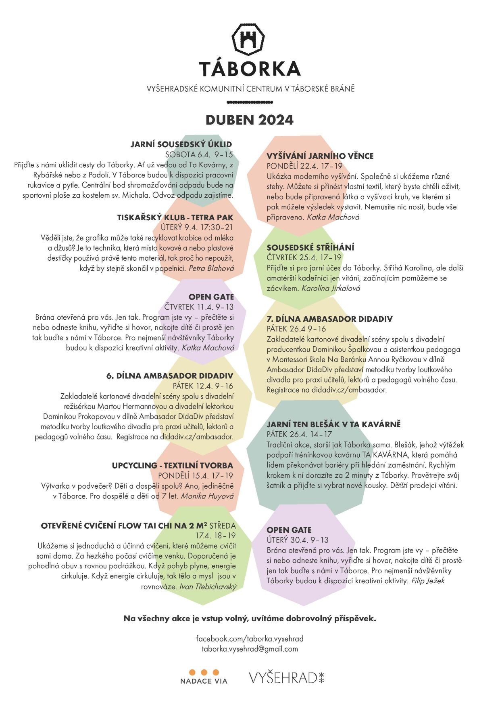

[Táborská brána na Vyšehradě](https://mapy.cz/s/kupodozeju) už není jen historickou památkou. Od jara 2023 je místem setkávání, kde mohou místní tvořit, relaxovat a vzdělávat se. Prostor, kde se potkávají sousedé, kteří by se jinak nepotkali a to hned ze 4 čtvrtí, které Vyšehrad obklopují. Překážkou jim není věk, hendikep či finanční možnosti. Podpořte mezigenerační křižovatku!

* [Odebírejte newsletter](https://dashboard.mailerlite.com/forms/349654/86367320907187267/share) a budete všechno vědět první
* [Podpořte Táborku](https://www.darujme.cz/taborka)
* [Táborka na fb](https://www.facebook.com/taborka.vysehrad)

## Aktuálně

### Setkání s farmářem KPZ (komunitně podporované zemědělství)
Rádi bychom založili skupinu odběratelů ovoce a zeleniny přímo od farmáře se závozem do Táborské brány. Ve **čtvrtek 11. 4. od 17** hodin proto pořádáme setkání se zemědelcem panem [Králičkem z Nového Bydžova](http://www.kralickovabiozelenina.cz/), který by nám zeleninu mohl zavážet.
Přijďte se zeptat, co vás zajímá a rozhodnout s námi, zda se přidáme k odběratelům. I pokud nemáte zájem o odběr, přijďte se dozvědět vše, co jste kdy chtěli vědět o pěstování zeleniny v biokvalitě a neměli příležitost se zeptat.

### Jarní TenBlešák

Navštivte v **pátek 26.4. od 14h** tradiční jarní benefiční TenBlešák před TaKavárnou (100m od Táborské brány, Na Topolce 1b). Darujte co již nevyužijete či neunosíte a pošlete to dál. Dětští prodejci vítáni. Veškerý výtěžek jde na podporu tréninkového programu [TA KAVÁRNY](http://www.takavarna.cz/). 

## Program duben

## Programy minulé
* [Duben 2024](Programy/Táborka-DUBEN-2024.pdf)
* [Březen 2024](Programy/Táborka-BŘEZEN-2024-v2d.pdf)
* [Leden-únor 2024](Programy/Taborka-A4-plakat-ledenunor.pdf)

## Aktuální kalendář - co se děje
<iframe src="https://calendar.google.com/calendar/embed?height=600&wkst=2&ctz=Europe%2FPrague&bgcolor=%23ffffff&showCalendars=0&src=dGFib3JrYS52eXNlaHJhZEBnbWFpbC5jb20&color=%23F6BF26" style="border:solid 1px #777" width="800" height="600" frameborder="0" scrolling="no"></iframe>

## Děkujeme
*  [Nadace Via](https://www.nadacevia.cz/)
*  [Národní kulturní památka Vyšehrad](https://www.praha-vysehrad.cz/cs)

\
*Vaše*

Táborka z.s., \
IČO 19535970\
[taborka.vysehrad@gmail.com](mailto:taborka.vysehrad@gmail.com)
