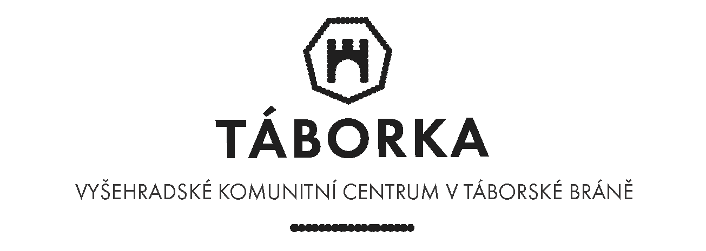
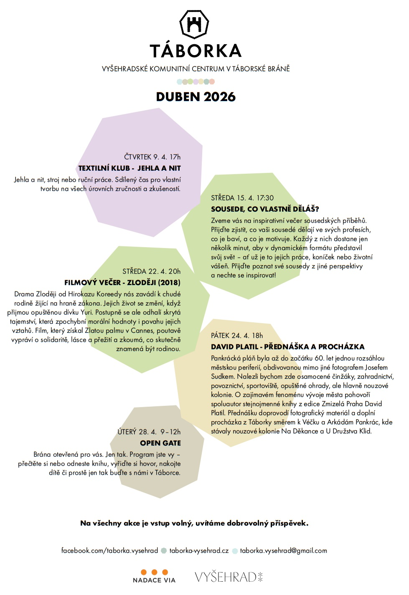

[Táborská brána na Vyšehradě](https://mapy.cz/s/kupodozeju) už není jen historickou památkou. Od jara 2023 je místem setkávání, kde mohou místní tvořit, relaxovat a vzdělávat se. Prostor, kde se potkávají sousedé, kteří by se jinak nepotkali a to hned ze 4 čtvrtí, které Vyšehrad obklopují. Překážkou jim není věk, hendikep či finanční možnosti. Podpořte mezigenerační křižovatku!

* [Odebírejte newsletter](https://dashboard.mailerlite.com/forms/349654/86367320907187267/share) a budete všechno vědět první
* [Podpořte Táborku](https://www.darujme.cz/taborka)
* [Táborka na fb](https://www.facebook.com/taborka.vysehrad)

## Program Duben

Milí sousedé,

jaro je v plném proudu a naše vyšehradské komunitní centrum v Táborské bráně se v dubnu opět stane místem, kde se můžeme společně zastavit, tvořit a lépe se poznat. 

Hned 9. dubna oprašujeme [Textilní klub](https://www.facebook.com/events/1436048321048631), kde můžete tvořit, ať už jste začátečníci nebo pokročilí.

Zajímá vás, kdo vlastně bydlí ve vašem vchodě nebo ulici? Ve středu 15. dubna nás čeká další večer [„Sousede, co vlastně děláš?“](https://www.facebook.com/events/2690180038031295), kde v dynamickém formátu představí vaši sousedé své profese i koníčky.

Pro milovníky kinematografie promítáme 22. dubna oceňované japonské drama [Zloději](https://www.facebook.com/events/797474276737128) ([Profil na ČSFD](https://www.csfd.cz/film/603900-zlodeji/prehled/)), které citlivě zkoumá otázky solidarity a rodinných pout.

V pátek 24. dubna nás David Platil [provede fascinujícím vývojem Pankrácké pláně](https://www.facebook.com/events/1621403952080457) – od periferie s nouzovými koloniemi až po dnešní podobu. Přednášku doplníme společnou procházkou.

Zapište si do diářů! Ten Blešák u Ta Kavárny se uskuteční 28.5. od 15h. Pozvěte své přátele a sledujte [FB událost](https://www.facebook.com/events/919501914298786/).

Na všechny naše akce je vstup volný, budeme však vděční za jakýkoliv dobrovolný příspěvek.

## Aktuální kalendář - co se děje
<iframe src="https://calendar.google.com/calendar/embed?height=600&wkst=2&ctz=Europe%2FPrague&bgcolor=%23ffffff&showCalendars=0&src=dGFib3JrYS52eXNlaHJhZEBnbWFpbC5jb20&color=%23F6BF26" style="border:solid 1px #777" width="800" height="600" frameborder="0" scrolling="no"></iframe>

## Programy v pdf
* [Duben 2026](Programy/Taborka-2026-04.pdf)
* [Březen 2026](Programy/Taborka-2026-03.pdf)
* [Prosinec 2025](Programy/Taborka-2025-12.pdf)
* [Listopad 2025](Programy/Taborka-2025-11.pdf)
* [Říjen 2025](Programy/Taborka-2025-10.pdf)
* [Zažít město jinak 2025](Programy/ZMJ-Vysehrad-2025.pdf)
* [Červen 2025](Programy/Taborka-2025-06.pdf)
* [Květen 2025](Programy/Taborka-2025-05.pdf)
* [Duben 2025](Programy/Taborka-2025-04.pdf)
* [Březen 2025](Programy/Taborka-2025-03.pdf)
* [Leden-únor 2025](Programy/Taborka-2025-01_02.pdf)
* [Prosinec 2024](Programy/Taborka-2024-12.pdf)
* [Listopad 2024](Programy/Taborka-2024-11.pdf)
* [Říjen 2024](Programy/Taborka-2024-10rijen.pdf)
* [Září 2024](Programy/Taborka-2024-09.pdf), [Zažít město jinak 2024](Imgs/Plakat_ZMJ.png)
* [Červenec a srpen 2024](Programy/Taborka-2024-0708.jpg)
* [Červen 2024](Programy/Taborka-2024-06.pdf )
* [Květen 2024](Programy/Taborka-2024-05.pdf )
* [Duben 2024](Programy/Taborka-DUBEN-2024.pdf )
* [Březen 2024](Programy/Taborka-BŘEZEN-2024-v2d.pdf)
* [Leden-únor 2024](Programy/Taborka-A4-plakat-ledenunor.pdf)
* [Prosinec 2023](Programy/Taborka-2023-12.jpg)
* [Listopad 2023](Programy/Taborka-2023-11.jpg)
* [Říjen 2023](Programy/Taborka-2023-10rijen.pdf)
* [Září 2023](Programy/Taborka-2023-09zari.pdf)
* [Jaro 2023](Programy/Taborka-2023-05PrvniJaro.jpg)

## Děkujeme
*  [Nadace Via](https://www.nadacevia.cz/)
*  [Národní kulturní památka Vyšehrad](https://www.praha-vysehrad.cz/cs)

  
*Vaše*  
  
Táborka z.s.  
IČO 19535970  
Ve Svahu 1, Praha 4  
(Ale najdete nás o kousek vedle, V pevnosti 35/11, Praha 2)  
  
[taborka.vysehrad@gmail.com](mailto:taborka.vysehrad@gmail.com)  
  
[Výroční zpráva 2024](Imgs/Taborka-vyrocni zprava 2024.pdf)  
[Výroční zpráva 2023](Imgs/Taborka-vyrocni zprava 2023.pdf)  
[Stanovy spolku](Imgs/Taborka-stanovy.pdf)  
  
  
---
*[[Edit]](https://github.com/filip-jezek/taborka_cz)*
