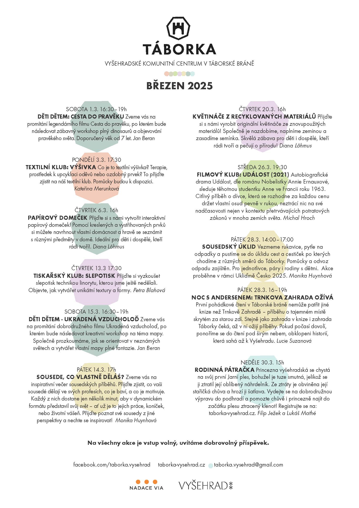

[Táborská brána na Vyšehradě](https://mapy.cz/s/kupodozeju) už není jen historickou památkou. Od jara 2023 je místem setkávání, kde mohou místní tvořit, relaxovat a vzdělávat se. Prostor, kde se potkávají sousedé, kteří by se jinak nepotkali a to hned ze 4 čtvrtí, které Vyšehrad obklopují. Překážkou jim není věk, hendikep či finanční možnosti. Podpořte mezigenerační křižovatku!

* [Odebírejte newsletter](https://dashboard.mailerlite.com/forms/349654/86367320907187267/share) a budete všechno vědět první
* [Podpořte Táborku](https://www.darujme.cz/taborka)
* [Táborka na fb](https://www.facebook.com/taborka.vysehrad)

## Aktuálně

### KPZ (komunitně podporované zemědělství)
Chcete pravidelný závoz sezonní biozeleniny od českého farmáře? Zapojte se do již druhého ročníku Táborské KPZ! KPZ, neboli Komunitou Podporované Zemědělství, funguje na principu “předplatného” zeleniny přímo od farmáře. Cíl je mít kvalitní biozeleninu za dostupnou cenu, ta naše bude opět od pana Králíčka. [Více informací](Pages/KPZ_info.html)
[Chci se přidat!](https://forms.gle/EHdZUK2bTq6gXKku8)

### Registrace na rodinnou pátračku
Princezna vyšehradská se chystá na svůj první Jarní ples, bohužel je tuze smutná, jelikož se ji ztratil její oblíbený náhrdelník. 
Ze ztráty je obviněna její stařičká chůva a hrozí ji šatlava. 
Vydejte se na dobrodružnou výpravu do podhradí a pomozte chůvě i princezně najít do začátku plesu ztracený klenot!

Prosím [napište se nám do tabulky](https://docs.google.com/spreadsheets/d/1-4EGMahYhjlaxOUQCQgE8I3BT3PL_8vy5k3odaNHTjI/edit?usp=sharing) ať víme kdy s vámi počítat! Díky!

## Program Leden a únor

## Aktuální kalendář - co se děje
<iframe src="https://calendar.google.com/calendar/embed?height=600&wkst=2&ctz=Europe%2FPrague&bgcolor=%23ffffff&showCalendars=0&src=dGFib3JrYS52eXNlaHJhZEBnbWFpbC5jb20&color=%23F6BF26" style="border:solid 1px #777" width="800" height="600" frameborder="0" scrolling="no"></iframe>

## Programy v pdf
* [Březen 2025](Programy/Taborka-2025-03.pdf)
* [Leden-únor 2025](Programy/Taborka-2025-01_02.pdf)
* [Prosinec 2024](Programy/Taborka-2024-12.pdf)
* [Listopad 2024](Programy/Taborka-2024-11.pdf)
* [Říjen 2024](Programy/Taborka-2024-10rijen.pdf)
* [Září 2024](Programy/Taborka-2024-09.pdf), [Zažít město jinak 2024](Imgs/Plakat_ZMJ.png)
* [Červenec a srpen 2024](Programy/Taborka-2024-0708.jpg)
* [Červen 2024](Programy/Taborka-2024-06.pdf )
* [Květen 2024](Programy/Taborka-2024-05.pdf )
* [Duben 2024](Programy/Taborka-DUBEN-2024.pdf )
* [Březen 2024](Programy/Taborka-BŘEZEN-2024-v2d.pdf)
* [Leden-únor 2024](Programy/Taborka-A4-plakat-ledenunor.pdf)
* [Prosinec 2023](Programy/Taborka-2023-12.jpg)
* [Listopad 2023](Programy/Taborka-2023-11.jpg)
* [Říjen 2023](Programy/Taborka-2023-10rijen.pdf)
* [Září 2023](Programy/Taborka-2023-09zari.pdf)
* [Jaro 2023](Programy/Taborka-2023-05PrvniJaro.jpg)

## Děkujeme
*  [Nadace Via](https://www.nadacevia.cz/)
*  [Národní kulturní památka Vyšehrad](https://www.praha-vysehrad.cz/cs)

\
*Vaše*

Táborka z.s.\
IČO 19535970 \
Ve Svahu 1, Praha 4 \
(Ale najdete nás o kousek vedle, V pevnosti 35/11, Praha 2)\
\
[taborka.vysehrad@gmail.com](mailto:taborka.vysehrad@gmail.com)\
\
[Stanovy spolku](Imgs/Taborka-stanovy.pdf)\
[Výroční zpráva 2023](Imgs/Taborka-vyrocni zprava 2023.pdf)\
\
---
*[[Edit]](https://github.com/filip-jezek/taborka_cz)*
